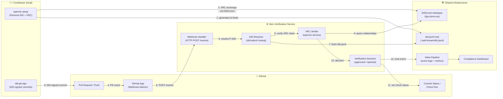

# ADR-001 — Hero: Contributor Identity Verification System

| Field | Value |
|-------|-------|
| **Status** | Proposed |
| **Date** | 2026-04-13 |
| **Author** | Ojas Shelke (`lfx-hero-identity`) |
| **Mentorship** | LFDT LFX — *Hero: Contributor Identity Verification Prototype* |
| **Deciders** | @AlexanderShenshin (mentor), OpenVTC maintainers |

---

## Context & Problem Statement

Open-source projects accept contributions from thousands of individuals globally,
yet the **identity of contributors is implicitly trusted at face value**. A
username, an email address, and a GPG key can all be forged or transferred. There
is no portable, cryptographically verifiable mechanism that links:

- A **real person** (Personhood Credential — PHC) to
- A **specific GitHub account** to
- **Every commit and pull-request** they open.

Without such a link, supply-chain attacks (malicious commits from compromised
accounts), sybil attacks (one actor pretending to be many), and silent committer
substitutions remain undetectable at PR review time.

The **Hero** project within the LFDT LFX mentorship programme aims to build a
prototype that closes this gap by combining:

1. **OpenVTC** — local CLI tool and background service for managing `did:webvh`
   Persona DIDs (P-DIDs), Verifiable Relationship Credentials (VRCs), and
   DIDComm-based peer-to-peer trust.
2. **GitHub App + Webhook listener** — captures PR / push events and queries
   OpenVTC for a verification decision.
3. **Heka** — log aggregation and policy-decision pipeline that persists
   verification events and drives compliance dashboards.

This document records the **architectural decisions** for the Hero prototype,
explains where each component fits, and provides a reference point for subsequent
ADRs that will detail sub-components.

---

## Decision

Implement the Hero prototype as a **thin verification layer** that sits
*between GitHub events and merge decisions*, using the OpenVTC DID / VRC stack
as the trust anchor.

The system has five logical layers:

| Layer | Component | Responsibility |
|-------|-----------|----------------|
| **Identity** | `openvtc-cli` / `openvtc-cli2` | Contributor sets up a `did:webvh` P-DID and obtains VRCs from maintainers |
| **Signing** | `did-git-sign` | Every commit is signed with the contributor's DID Ed25519 key via VTA |
| **Event capture** | GitHub App + Webhook listener | Listens for `pull_request`, `push`, and `check_run` events |
| **Verification** | `openvtc-service` (Hero adapter) | Resolves contributor DID, verifies VRC chain, emits a decision |
| **Observability** | Heka pipeline | Aggregates verification events, feeds compliance dashboards |

---

## Architecture Diagram



---

## Component Responsibilities

### 1. Contributor Setup (existing — `openvtc-cli`)

Each contributor runs `openvtc setup` once:

- Generates a `did:webvh` **Persona DID (P-DID)** anchored at a public URL
  (GitHub Pages, Vercel, or similar).
- Publishes `did.jsonl` at `/.well-known/did.jsonl` under that domain.
- Exchanges **Verifiable Relationship Credentials (VRCs)** with project
  maintainers via DIDComm.
- Configures **`did-git-sign`** so every subsequent commit is signed with the
  DID's Ed25519 key.

### 2. GitHub App (to-be-built — `openvtc-github`)

A minimal GitHub App (Node.js / Rust `axum` server) that:

- Registers a webhook for `pull_request` and `push` events on enrolled repos.
- Extracts the commit author's email / git signature.
- Maps the git signature to a `did:webvh` identifier.
- Calls the Hero Verification Service and reports back a **GitHub commit status**
  or **check run result** (✅ / ❌).

> **Scope note:** The GitHub App is not in this repository today. This ADR
> proposes it as the next major deliverable for the Hero prototype. A stub
> implementation will be placed in `openvtc-github/` in a future PR.

### 3. Hero Verification Service (extends `openvtc-service`)

The existing `openvtc-service` listens on DIDComm. For Hero, it is extended
with an HTTP endpoint (`POST /verify`) that accepts a JSON payload containing:

```json
{
  "contributor_did": "did:webvh:...",
  "commit_sha": "abc123",
  "repository": "org/repo",
  "vrc_required": true
}
```

It performs:

1. **DID resolution** — resolves contributor's `did.jsonl` and verifies the
   document is self-consistent and not revoked.
2. **VRC chain verification** — checks that the contributor holds a valid VRC
   signed by an enrolled maintainer of the target repository.
3. **Signature verification** — optionally verifies the commit SSH signature
   matches the contributor's DID verification method.
4. Returns `{"status": "approved" | "rejected", "reason": "..."}`.

### 4. Heka Pipeline

[Heka](https://hekad.readthedocs.io/) (or a compatible log-shipper) receives
structured JSON events from the verification service:

```json
{
  "event": "verification_result",
  "contributor_did": "did:webvh:...",
  "repository": "org/repo",
  "commit_sha": "abc123",
  "result": "approved",
  "timestamp": "2026-04-13T08:00:00Z"
}
```

These events feed:

- A **compliance dashboard** showing per-repo and per-contributor verification
  rates.
- **Alerting** for repeated rejections (potential account takeover).
- **Audit logs** for LFDT governance.

---

## How OpenVTC Fits into the Hero System

```
OpenVTC (existing)                Hero additions
────────────────────────────────────────────────────────────────────
openvtc-cli       ───► establishes P-DID & VRCs (contributor side)
did-git-sign      ───► signs every commit with DID key
openvtc-service   ───► extended with /verify HTTP endpoint
openvtc-lib       ───► provides DID resolution, VRC, crypto primitives

                  GitHub App ─────────────────────────────────────
                  (new: openvtc-github)
                       │  captures PR/push events
                       │  queries /verify
                       └─► sets GitHub check status

                  Heka pipeline ──────────────────────────────────
                  (new: ops/heka/)
                       │  receives verification events
                       └─► compliance dashboard
```

**OpenVTC is the trust layer.** It owns the DID lifecycle, key management,
VRC issuance/verification, and DIDComm messaging. The GitHub App and Heka
pipeline are thin integration points that consume OpenVTC's verification
decisions — they do not reimplement any identity logic.

---

## Consequences

### Benefits

- **Cryptographic provenance** — every merged commit can be traced back to a
  person who holds a DID-anchored identity and a VRC from a trusted maintainer.
- **Standards-based** — uses W3C DID Core, W3C VC Data Model, and DIF DIDComm
  v2; no proprietary identity provider lock-in.
- **Portable** — contributors carry their P-DID across projects; they do not
  re-enrol per repo.
- **Privacy-preserving** — VRC exchange is peer-to-peer over DIDComm; no
  central database of contributor identities.
- **Incremental adoption** — projects can start in "advisory" mode (verification
  reported but not blocking) and graduate to "enforced" mode.

### Trade-offs / Risks

| Risk | Mitigation |
|------|-----------|
| Mediator availability (`fpp.storm.ws` 502s block verification) | Implement mediator health check; fall back to direct DID resolution for read-only paths; document `OPENVTC_MEDIATOR_DID` override |
| Cold-start UX (contributors must run `openvtc setup` before first PR) | Provide a GitHub Actions workflow that guides first-time contributors; consider a grace-period "advisory" mode |
| `openvtc setup` requires a TTY — blocks CI/CD and non-interactive environments | Implement `openvtc setup --from-file` (tracked in issue backlog) |
| Heka is archived upstream (EOL since 2016) | Evaluate replacement (Vector, Fluent Bit, OpenTelemetry Collector); Heka used here as specification placeholder |
| Key rotation — contributor updates P-DID keys | WebVH pre-rotation key mechanism handles this natively; GitHub App must re-verify on key update |

---

## Implementation Roadmap

| Phase | Deliverable | Status |
|-------|-------------|--------|
| 1 | `openvtc-lib`, `openvtc-cli`, `did-git-sign` | ✅ Complete |
| 2 | `openvtc-service` DIDComm message handler | ✅ Complete |
| 3 | `/verify` HTTP endpoint in `openvtc-service` | 🔲 Planned |
| 4 | `openvtc-github` — GitHub App + webhook handler | 🔲 Planned |
| 5 | Heka / OTel event pipeline | 🔲 Planned |
| 6 | Compliance dashboard (Grafana / static) | 🔲 Planned |
| 7 | End-to-end integration test (PR → decision) | 🔲 Planned |

---

## References

- [First Person Project White Paper](https://www.firstperson.network/white-paper)
- [W3C DID Core Specification](https://www.w3.org/TR/did-core/)
- [W3C Verifiable Credentials Data Model](https://www.w3.org/TR/vc-data-model/)
- [DIF DIDComm Messaging v2](https://identity.foundation/didcomm-messaging/spec/)
- [did:webvh Method Specification](https://identity.foundation/didwebvh/v1.0)
- [Affinidi TDK (Rust)](https://github.com/affinidi/affinidi-tdk-rs)
- [LFX Mentorship — Hero Issue #87](https://github.com/LF-Decentralized-Trust-Mentorships/mentorship-program/issues/87)
- [OpenVTC Repository](https://github.com/OpenVTC/openvtc)
